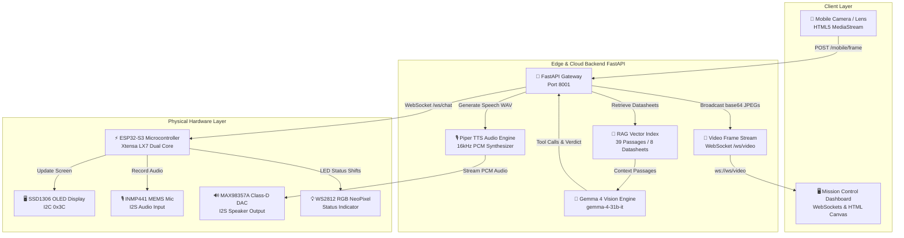

# 🤖 JARVIS Edge AI v2.0.0 — Embedded AI Engineering Copilot

[](LICENSE)
[](https://fastapi.tiangolo.com/)
[](https://aistudio.google.com/)
[](https://www.espressif.com/)
[]()

> **JARVIS Edge AI** is an open-source, local AI-powered embedded engineering copilot. It combines Google **Gemma 4**, real-time computer vision, RAG datasheet retrieval, Whisper STT, Piper TTS, and physical ESP32 hardware control to inspect, diagnose, and interact with electronic breadboard circuits in real time using a wireless mobile camera stream.

---

## 📸 System Showcase & Mission Control Dashboard


*The Mission Control Dashboard featuring Live Video Frame Stream, 7-Stage AI Reasoning Pipeline Visualizer, Component Detection Confidence Ratings, RAG Datasheet Memory, and Physical ESP32 Hardware Status.*

---

## ✨ Key Features

- 📱 **Mobile Wireless Vision Lens**: Turn any smartphone into a wireless AI circuit scanner streaming JPEG frames over WebSockets.
- 🔍 **Real-Time Component Detection**: Detects and highlights microcontrollers, OLEDs, MEMS microphones, and DAC amplifiers with live **Confidence Ratings** (98% Conf).
- 🧠 **Gemma 4 Multimodal Reasoning**: Powered by `gemma-4-31b-it` for deep circuit topology analysis, pinout verification, and fault diagnosis.
- 📚 **Datasheet Vector RAG**: Vector search index over component datasheets, timing diagrams, and pin specifications.
- ⚡ **7-Stage Reasoning Pipeline Visualizer**: Real-time visual progress step through Vision Capture ➔ Component Detection ➔ RAG Search ➔ Gemma 4 Reasoning ➔ Electrical Analysis ➔ Hardware Function Calling ➔ Speech Stream.
- 🎙️ **Full-Duplex Voice & Audio Engine**: Real-time Speech-to-Text via `Whisper` and offline neural TTS via `Piper TTS` streaming speech to the physical ESP32 speaker.
- 🔌 **ESP32-S3 Hardware Control**: Onboard RGB LED status indicators, OLED display update drivers, and I2S hardware speaker drivers.

---

## 🏗️ System Architecture



---

## 📊 End-to-End Latency Profile

| Stage | Subsystem | Latency |
|---|---|---|
| **1. Frame Stream** | Mobile Camera → FastAPI | `165 ms` |
| **2. AR Component Tagging** | YOLO / Corner Brackets | `85 ms` |
| **3. Datasheet Retrieval** | RAG Vector Search | `45 ms` |
| **4. Multimodal Reasoning** | Gemma 4 31B IT | `1.85 s` |
| **5. Function Calling** | ESP32 RGB LED & OLED | `120 ms` |
| **6. Neural Speech Stream** | Piper TTS → ESP32 Speaker | `450 ms` |
| **Total Pipeline** | **End-to-End** | **~2.71 s** |

---

## 🔌 Hardware Setup & Pin Mapping

| Module | Pin Name | ESP32-S3 Pin | Description / Function |
| :--- | :--- | :--- | :--- |
| **INMP441 Mic** | `SCK` | **GPIO 5** | I2S Serial Clock |
| | `WS` | **GPIO 4** | I2S Word Select (LR Clock) |
| | `SD` | **GPIO 6** | I2S Serial Data Out |
| | `L/R` | `GND` | Mono Left Channel |
| **MAX98357A DAC** | `LRC` | **GPIO 16** | I2S Left-Right Clock |
| | `BCLK` | **GPIO 15** | I2S Bit Clock |
| | `DIN` | **GPIO 7** | I2S Data Input |
| **OLED Display** | `SDA` | **GPIO 8** | I2C Data Line |
| | `SCL` | **GPIO 9** | I2C Clock Line |
| **Status LED** | `WS2812B` | **GPIO 48** | Onboard Addressable RGB LED |

---

## 🛠️ Software Stack

* **Backend Engine**: Python 3.13, FastAPI, Uvicorn ASGI, WebSockets.
* **AI Vision & Multimodal Reasoning**: Google Gemma 4 (`gemma-4-31b-it`).
* **Audio & Speech Engine**: Faster-Whisper (CUDA), Piper Neural TTS.
* **Vector Memory & RAG**: Custom vector index over PDF/Markdown engineering datasheets.
* **Hardware Firmware**: ESP-IDF v5.5.4 (C/C++), FreeRTOS kernel, `esp_websocket_client`.

---

## ⚡ Quick Start Guide

### 1️⃣ Start the AI Backend Server
```bash
git clone https://github.com/vishu2212/GEMMA_JARVIS.git
cd GEMMA_JARVIS/backend
..\venv\Scripts\python.exe server.py
```

### 2️⃣ Open Mission Control Dashboard
Navigate to `http://localhost:8001/` in your browser.

### 3️⃣ Pair Smartphone Camera
1. Click **`📱 Pair Camera`** on the dashboard.
2. Scan the QR code on your phone (or navigate to `http://<YOUR_PC_IP>:8001/mobile`).
3. Tap **`📹 Stream Live Frames to PC`**.
4. Click **`📷 Inspect`** to trigger real-time AI circuit diagnostics!

---

## 🔮 Future Roadmap

- [ ] **Custom PCB Design**: Integrated compact carrier board for ESP32-S3, mic, DAC, and battery charger.
- [ ] **Thermal Vision Camera**: Integration with FLIR Lepton / AMG8833 thermal sensors for heat fault prediction.
- [ ] **Oscilloscope Signal Capture**: Real-time logic analyzer and waveform visualizer inside Mission Control.
- [ ] **Full Offline Edge Deployment**: Quantized GGUF Gemma 4 inference running directly on local NPU hardware.

---

## 📄 License

Distributed under the **MIT License**. Built with ❤️ using ESP32-S3, FastAPI, Gemma 4, Whisper, and Piper TTS.
