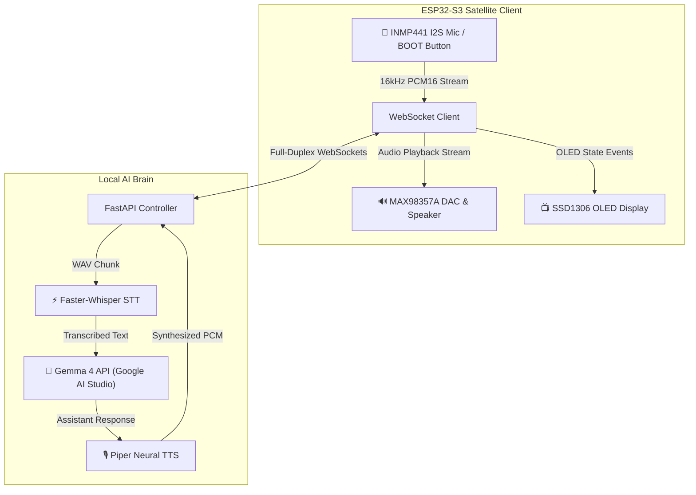

# 🤖 JARVIS Edge AI — Embedded Engineering Copilot powered by Gemma 4

## 📌 Project Overview
**JARVIS Edge AI** is an intelligent, real-time voice assistant and embedded engineering copilot designed for hardware developers, IoT engineers, and robotics builders. Powered by **Google's Gemma 4 (`gemma-4-31b-it`)** via the Google AI Studio API, JARVIS runs on a compact **ESP32-S3 microcontroller satellite** paired with a local Python AI server.

Unlike generic voice assistants, JARVIS is specifically tuned as an **Embedded Hardware Troubleshooter & Circuit Assistant**. It can diagnose ESP32 flashing failures, explain digital communication protocols (I2S, SPI, I2C), debug blank OLED screens, and calculate pinouts—all delivered via real-time spoken audio and OLED visual state feedback.

---

## 🎯 The Problem & Innovation

### The Problem
Embedded systems development involves frequent hardware friction: missing UART drivers, bootloader pin states (GPIO 0), I2S clock mismatches, or power rail drops. Searching documentation or datasheets mid-breadboard wiring breaks context and slows down debugging.

### The Innovation
JARVIS brings **Gemma 4** directly onto the hardware workbench. With full-duplex WebSockets, 16kHz PCM audio streaming, and dedicated embedded system instructions, developers can speak naturally to their workbench to diagnose hardware bugs and ask engineering questions in real-time.

---

## 🏗️ System Architecture & Data Flow

$$\text{INMP441 I2S Mic} \xrightarrow{\text{16kHz PCM}} \text{ESP32-S3} \xrightarrow{\text{WebSocket}} \text{Faster-Whisper STT} \xrightarrow{\text{Text}} \mathbf{\text{Gemma 4 API}} \xrightarrow{\text{Response}} \text{Piper Neural TTS} \xrightarrow{\text{PCM}} \text{MAX98357A Speaker}$$

---

## 🛠️ Key Features

1. **Gemma 4 Intelligence**: Powered by `gemma-4-31b-it` via Google AI Studio API for deep hardware & C/C++ reasoning.
2. **Embedded Debug Mode**: Instant step-by-step troubleshooting for flashing failures, boot pin states, driver issues, and display glitches.
3. **Full-Duplex WebSocket Pipeline**: Sub-second end-to-end voice latency over local Wi-Fi.
4. **Dynamic OLED Visualizer**: Displays live pipeline stages: `Listening...` $\rightarrow$ `Transcribing...` $\rightarrow$ `Reasoning with Gemma 4...` $\rightarrow$ `Speaking...`.
5. **Hands-Free & Push-To-Talk**: Supports both OpenWakeWord ("Hey Jarvis") and physical BOOT button activation.
6. **Digital Hardware Controls**: Adjust volume dynamically via voice (*"Set volume to 80%"*).

---

## 🔌 Hardware Setup & Pinout

| Module | Pin Name | ESP32-S3 Pin | Function |
| :--- | :--- | :--- | :--- |
| **INMP441 Mic** | `SCK`, `WS`, `SD` | **GPIO 5, 4, 6** | I2S Audio Capture |
| **MAX98357A DAC** | `LRC`, `BCLK`, `DIN` | **GPIO 16, 15, 7** | I2S Audio Output |
| **SSD1306 OLED** | `SDA`, `SCL` | **GPIO 8, 9** | I2C Display (0x3C) |
| **User Input** | `BOOT Button` | **GPIO 0** | Physical Trigger |

---

## 🔮 Transparent Future Roadmap

| Version | Scope & Features |
| :--- | :--- |
| **v1.0 (Current)** | ESP32-S3 Voice Satellite, Faster-Whisper STT, **Gemma 4 API**, Piper Neural TTS, Embedded Troubleshooter Mode. |
| **v2.0 (Planned)** | Local Gemma ONNX/GGUF edge inference, ESP32 GPIO hardware control via Function Calling, Vision support for schematic inspection. |

---

## 📜 License
Distributed under the **MIT License**. Built with ❤️ using ESP32-S3, FastAPI, Faster-Whisper, Gemma 4, and Piper TTS.
